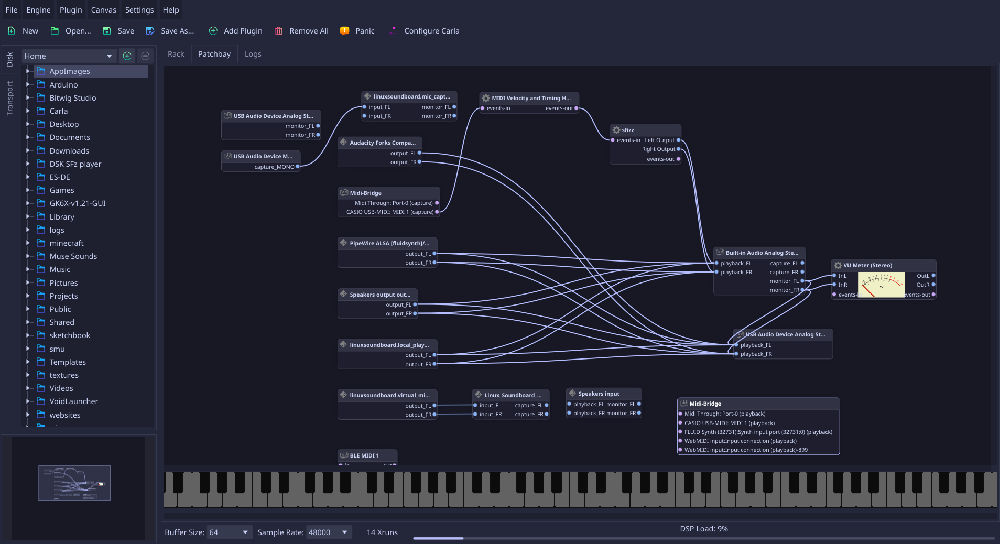

#  Carla Improved (Fork)

This is an enhanced fork of [Carla](https://github.com/falkTX/Carla) by [falkTX](https://github.com/falkTX), focusing on modern UI/UX improvements, workflow quality-of-life additions, and canvas responsiveness.

---

## Carla Improved Features & Changes

* **Canvas Node Quick Search (`Ctrl+F`)**:
  * In-canvas search bar with fuzzy-matching to quickly filter and locate nodes across large patchbays.
  * Interactive match list highlighting nodes on canvas and navigating/centering directly on selection.
* **Persistent Canvas Node Positioning**:
  * Node layout and split coordinates are automatically preserved and saved directly within `.carxp` project files.
  * Positions seamlessly restore when loading projects.
* **Recent Projects in File Menu**:
  * Quick access to recently opened and saved projects directly from the `File` menu.
  * Filenames displayed cleanly with full paths accessible via tooltip and status bar.
  * Startup prompt to resume the most recent project if none is loaded.
* **Modernized Patch Canvas Aesthetics**:
  * Blender-inspired socket aesthetics, rounded node containers, and refined port colors.
  * Improved node properties, auto-arrange centering, and text eliding for clean layouts.
  * Unified system typography across the UI.
* **Pianoroll & Theme Refinements**:
  * Enhanced pianoroll styling, improved piano keyboard bitmaps, and data-driven theme configurations.
  * CLI debug/logging flags (`--debug-ui`, etc.) for frontend diagnostics.
* **Arch Linux / Pacman Integration**:
  * Bundled [`PKGBUILD`](PKGBUILD) package (`carla-improved`) targeting Qt6 for clean package management.
  * Helper `build.sh` script for rapid local builds and testing.

---

## AI Clause

Portions of the modifications, features, refactoring, and documentation in this repository were developed and assisted by AI coding agents (including Google Antigravity / Gemini) working in collaboration with the repository maintainer. All contributions have been reviewed, tested, and integrated for quality and compatibility.

---

## Upstream Features

* LADSPA, DSSI, LV2, VST2, VST3, CLAP and AU plugin formats
* SF2/3 and SFZ sound banks
* Internal audio and midi file player
* Automation of plugin parameters via MIDI CC
* Remote control over [OSC](https://opensoundcontrol.stanford.edu/)
* Rack and Patchbay processing modes, plus Single and Multi-Client if using JACK
* Native audio drivers (ALSA, DirectSound, CoreAudio, etc) and JACK

In experimental phase / work in progress:
* Export any Carla loadable plugin or sound bank as an LV2 plugin
* Plugin bridge support (such as running 32bit plugins on a 64bit Carla, or Windows plugins on Linux)
* Run JACK applications as audio plugins
* Transport controls, sync with JACK Transport or Ableton Link

See the [upstream official webpage](https://kx.studio/Applications:Carla) for base documentation.

